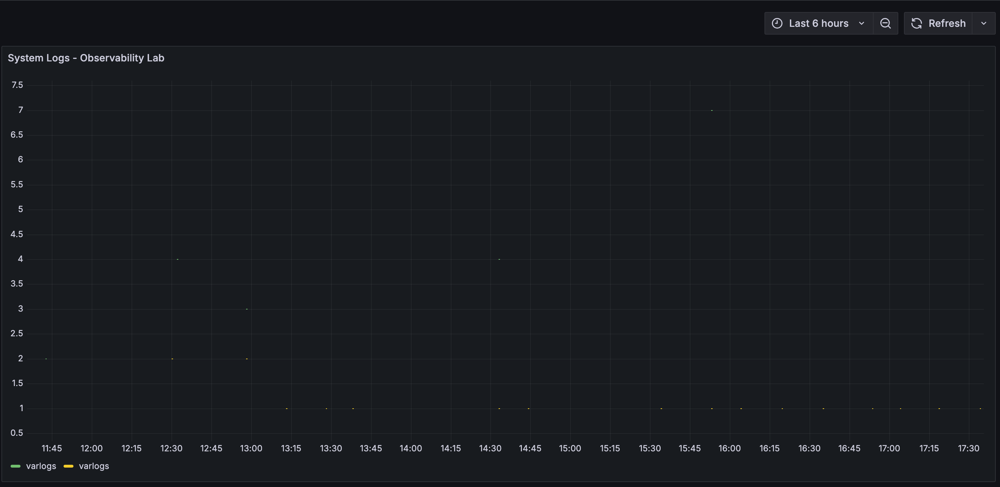
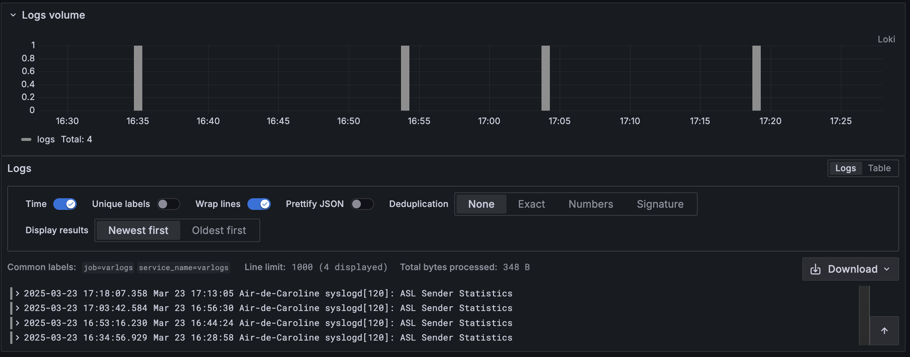
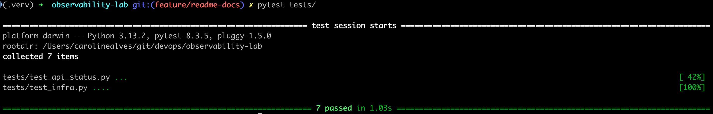
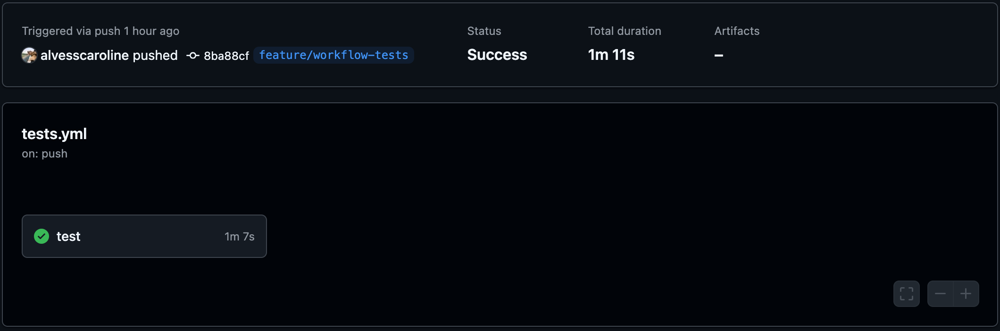

# Observability Lab

This project implements a complete observability stack using Prometheus, Grafana, Loki, Promtail, and Alertmanager. It provides a local monitoring and logging environment using Docker Compose and integrates automated tests and CI validation with GitHub Actions.

## Objective

To create a portable and replicable observability environment for development and learning purposes, covering:

- Metrics collection and visualization
- Centralized log aggregation
- Basic alerting rules
- Infrastructure and API health tests
- CI pipeline integration

## Technology Stack

- **Prometheus** – Metrics scraping and storage
- **Grafana** – Visualization of metrics and logs
- **Loki** – Centralized log storage and querying
- **Promtail** – Log collector that ships logs to Loki
- **Alertmanager** – Alert handling and routing for Prometheus
- **Pytest** – Infrastructure testing framework
- **GitHub Actions** – Continuous Integration for automated testing

## Project Structure

```
.
├── .github/workflows/           # GitHub Actions CI pipeline
├── docker-compose.yml           # Service orchestration
├── prometheus/
│   ├── prometheus.yml           # Prometheus configuration
│   └── alert.rules.yml          # Alerting rules
├── grafana/
│   └── provisioning/
│       ├── datasources/
│       │   └── datasource.yml
│       └── dashboards/
│           └── observability-lab.json
├── loki/
│   └── config.yml               # Loki configuration
├── promtail/
│   └── config.yml               # Promtail configuration
├── tests/
│   ├── requirements.txt         # Python dependencies
│   ├── test_api_status.py
│   └── test_infra.py
└── README.md
```

## Features

- Metrics collection from running services via Prometheus
- Structured log collection and querying via Loki
- File-based log shipping via Promtail
- Real-time dashboards for metrics and logs using Grafana
- Basic alerting rules (e.g., CPU > 80%)
- Automated health checks using Pytest
- CI pipeline that runs tests on each push or pull request

## How to Run Locally

Clone the repository and start the services:

```bash
git clone https://github.com/<your-user>/observability-lab.git
cd observability-lab
docker-compose up -d
```

Access Grafana:

- URL: http://localhost:3000  
- Username: `admin`  
- Password: `admin`

## Running the Tests

Create a Python virtual environment:

```bash
python3 -m venv .venv
source .venv/bin/activate
pip install -r tests/requirements.txt
```

Execute the tests:

```bash
pytest tests/
```

Tests include:

- Service readiness (Grafana, Prometheus, Loki)
- HTTP status checks for APIs
- Container health validation

## GitHub Actions: Continuous Integration

This project uses GitHub Actions to validate infrastructure on every push or pull request:

- Starts required containers
- Runs pytest test suite
- Displays test results directly in the GitHub interface

Workflow file: `.github/workflows/tests.yml`

## FinOps Considerations

| Practice                      | Benefit                               |
|------------------------------|----------------------------------------|
| Docker-based local stack     | No cloud resource costs                |
| GitHub Actions CI            | Free automation with no infrastructure overhead |
| Automated testing            | Reduced manual validation time         |
| Open-source stack            | No licensing costs                     |

## Screenshots

### 1. Grafana Panel: Logs over Time
Shows logs collected from `/var/log/*` by Promtail, visualized over time using the `count_over_time()` query.



### 2. Raw Log View in Logs Panel
Example of logs captured, categorized, and displayed through Loki.



### 3. Local Test Results with Pytest
Automated tests validating infrastructure and service readiness.



### 4. CI Workflow Success in GitHub Actions
Full test suite executed in GitHub Actions successfully.



## Author

Developed by Caroline Alves as a DevOps portfolio project.  